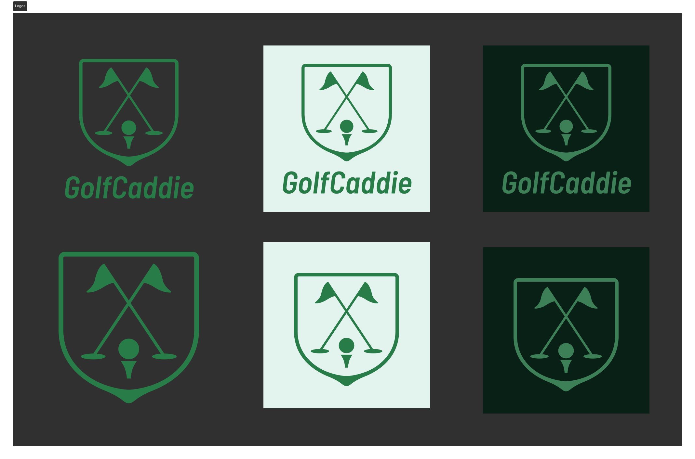

# GolfCaddie – GPS-Enabled Golf Caddie PWA

A modern Progressive Web App that transforms your phone into a virtual golf caddie, featuring real-time GPS tracking, smart club suggestions, and comprehensive round management.

## Table of Contents

- [Problem Solved](#problem-solved)
- [Key Features](#key-features)
- [Architecture](#architecture)
- [Deployment](#deployment)
- [Screenshots](#screenshots)
  - [Design Process](#design-process)
  - [Live Application](#live-application)
  - [Branding & Assets](#branding--assets)

## Problem Solved

Golfers need accurate distance measurements, shot tracking, and course management tools. Traditional golf apps are often clunky, expensive, or lack real-time GPS capabilities. GolfCaddie provides a seamless, mobile-first experience.

## Key Features

- **Real-time GPS Tracking** - Accurate distance measurements and shot positioning
- **Smart Club Suggestions** - AI-powered recommendations based on distance and conditions
- **Comprehensive Round Tracking** - Shot-by-shot performance analysis
- **Course Management** - Create, browse, and manage golf courses
- **Progressive Web App** - Installable to home screen
- **Round History** - Track performance over time with detailed statistics
- **Modern UI/UX** - Clean, intuitive design optimized for mobile use

## Architecture

### Frontend
- **React 19 + TypeScript** for type-safe development
- **Tailwind CSS** for responsive, mobile-first design
- **Google Maps API** for GPS and mapping functionality
- **TanStack Query** for efficient server state management
- **Framer Motion** for smooth animations
- **PWA** capabilities with service workers

### Backend (AWS Serverless)
- **AWS Lambda** - 12 serverless functions for different operations
- **Amazon DynamoDB** - User data, rounds, and course information
- **Amazon S3** - Course images and static assets
- **Amazon Cognito** - Secure user authentication
- **API Gateway** - RESTful API with rate limiting and CORS

### DevOps & Infrastructure
- **AWS CDK** - Infrastructure as Code
- **Docker** - Containerized deployment

## Deployment

The app is deployed on AWS with:
- **Frontend** - S3 + CloudFront for global distribution
- **Backend** - Lambda functions with API Gateway
- **Database** - DynamoDB with proper indexing
- **CDN** - CloudFront for optimal performance

## Screenshots

### Design Process
*Initial planning of pages, user flows, and types*

*Design inspiration and visual direction*

*Mid Fidelity wireframes*

*Final high fidelity UI designs*

### Live Application
*Mobile interface*

*Tablet interface*

### Branding & Assets
*Logo Variations*

